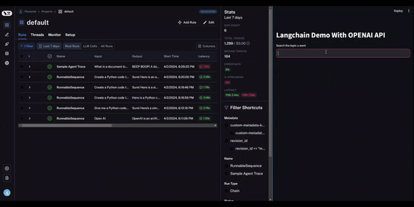
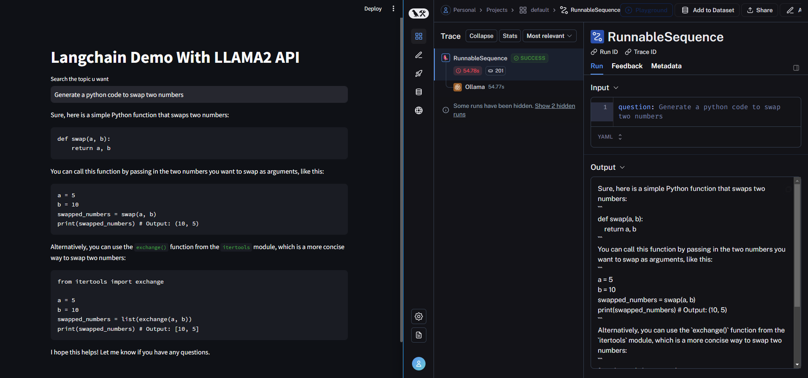
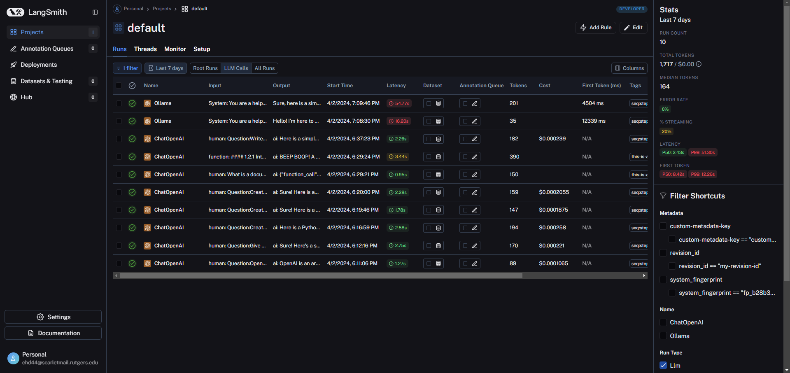

# Langchain Chat Bot with OPENAI API and OLLAMA Local

## Overview

Welcome to the Langchain Chat Bot project! This app is a testament to the power of OpenAI's APIs and the efficiency of Langchain's OLLAMA Local. It's designed to give you a seamless experience in conversational AI, showcasing the use of language models in real-time interactions. Dive into the world of AI-driven chat, all while monitoring the performance on Langsmith!

## Features

- A Streamlit-based chat interface to interact with the AI models.
- Integration with OpenAI API for conversational responses.
- Use of OLLAMA Local for local language model hosting and interactions.
- Real-time monitoring of chat sessions and model performance on Langsmith.

## Motivation

The curiosity to understand and use the langchain libraries. The combination of OPENAI API's expansive capabilities with the local deployment of OLLAMA's language models presents an intriguing opportunity to explore the power of AI in chat applications.

## How to Run the App

1. Clone the repository.
2. Install the required packages from `requirements.txt` using `pip install -r requirements.txt`.
3. Configure your `.env` file with your `LANGCHAIN_API_KEY` and `OPENAI_API_KEY`.
4. Execute `streamlit run locallama.py` or `streamlit run openai_app.py` to start the app.
5. Access the chat interface on your browser and start engaging with the AI!

## Dependencies

- Streamlit for the web interface.
- OpenAI for the conversational AI model.
- Langchain for running OLLAMA locally.
- `python-dotenv` for environment variable management.
- Refer to `requirements.txt` for specific versions and additional dependencies.

## App Demo

---

---

